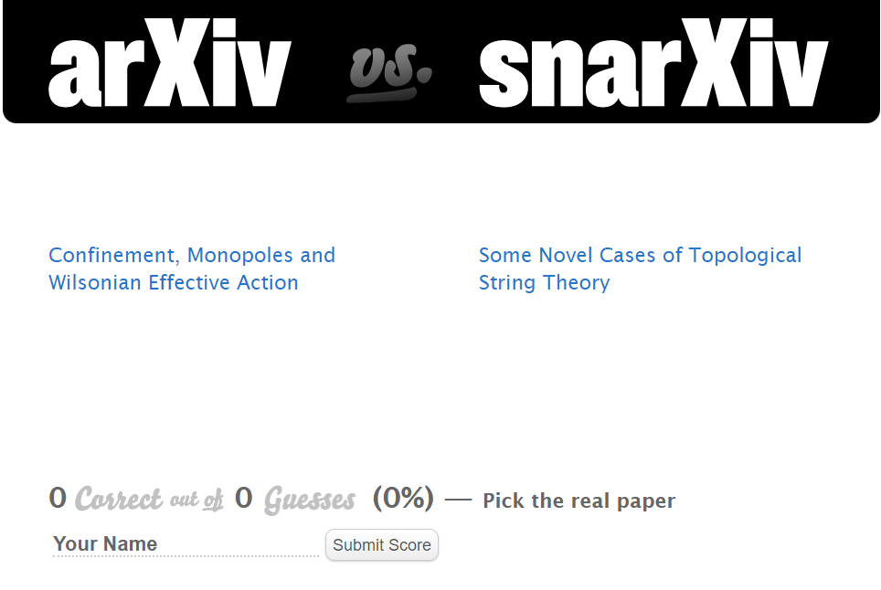
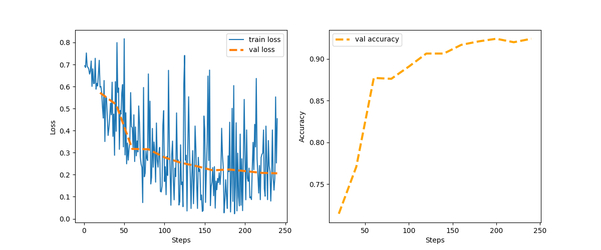

Simple and playful project for myself get familiar with fine tuning pretrained Language Models in HuggingFace. 

## Arxiv vs Snarxiv?

Arxiv vs Snarxiv is a game created by David Simmons-Duffin (https://snarxiv.org/vs-arxiv/) where fake (snarXiv) and real (arXiv) High Energy theory paper titles are displayed with the objective of guessing the real one. 



According to an older post by the author (https://davidsd.org/2010/09/the-arxiv-according-to-arxiv-vs-snarxiv/) the best performance was found in Austria with **62% accuracy**. 

## Goal

The goal of this repository is simple: fine-tune an existing pre-trained language model to see what performance we can reach on this game.

**Disclaimers**:

1) This is by no means an original idea or the first ML project involving this game. You can easily find several notebooks on Kaggle with similar ideas. 

2) Intented as a fun way to get familiar with HuggingFace, so a more thorough data analysis is left out. 


## Setting up and training
Close repository:

```python
git clone https://github.com/TimourIc/snarxiv-spotter
```

Create venv and install requirements:

```python
make venv
make requirements
```

Install your package in editable mode (required step for paths to work):

```python
pip install -e .
```

Get titles from arxiv and snarxiv and save for training and testing purposes in `data/`:

```python
python scripts/data_prep.py --SAMPLE_SIZE 3000
```

Train model and save in `results/models/`:


```python
python scripts/train.py  
```

Test model on separate test set:

```python
python scripts/test.py  
```

## Usage

To use the trained model and make a prediction run:

```python
python scripts/evaluate.py --TITLE <TITLE (STRING)>
```

## Results

Starting from the pre-trained DistilBERT model (https://arxiv.org/abs/1910.01108) we add a classification layer on the final hidden ouput and fine-tune the model. It appears that the model trains very rapidly and reaches a performance of >90% in a single epoch on a training set of 3600 titles.



On the final test we find an accuracy of **93%**. Although I have not yet found an easy argument for why the model trains so efficiently, note that the snarxiv titles are generated using fixed grammar rules and it's possible the model quickly picks up on this. Few examples:

1) The average length of the snarxiv titles and arxiv titles differs by 20%

2) As a simple example consider titles that start with the word: "Deriving". Snarxiv training and test sets have respectively 14 and 2 such cases, whereas such example is completely absent in the arxiv sets. It is likely there are many of such simple tells that the model can learn.
 
